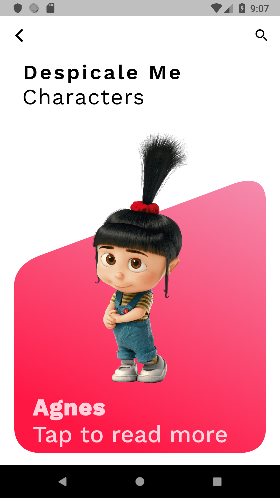
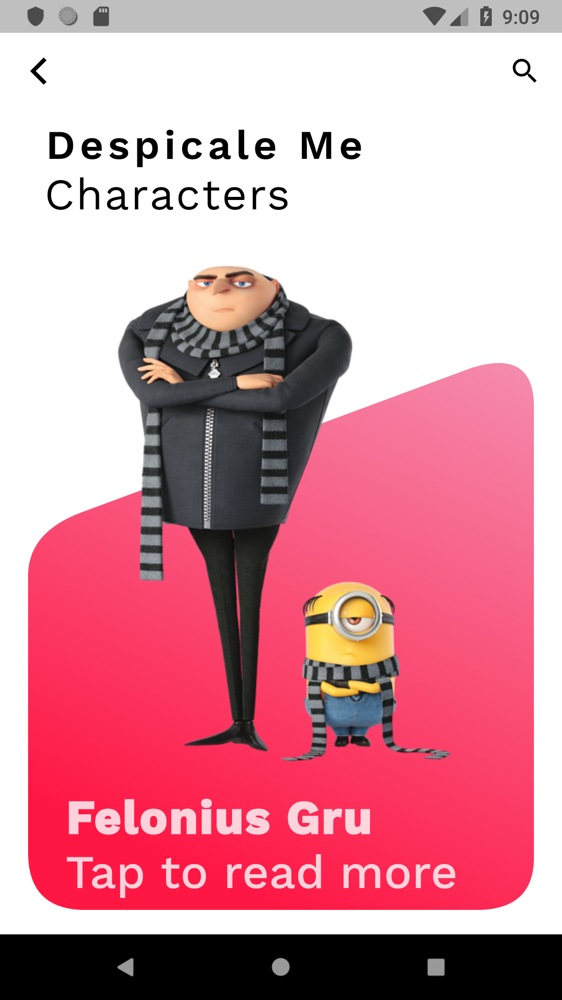
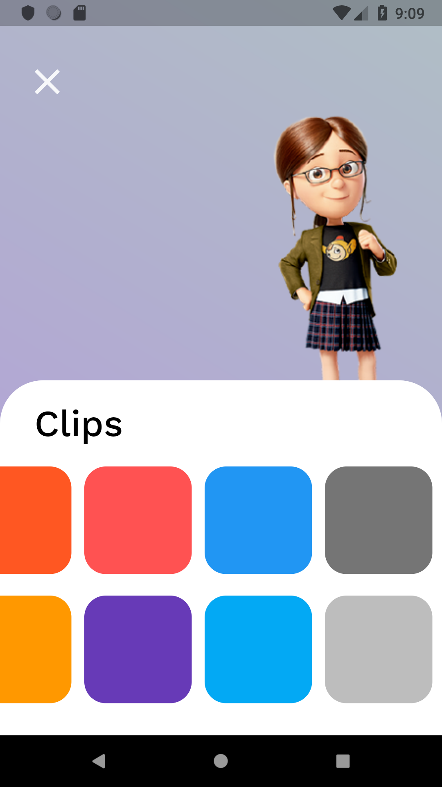
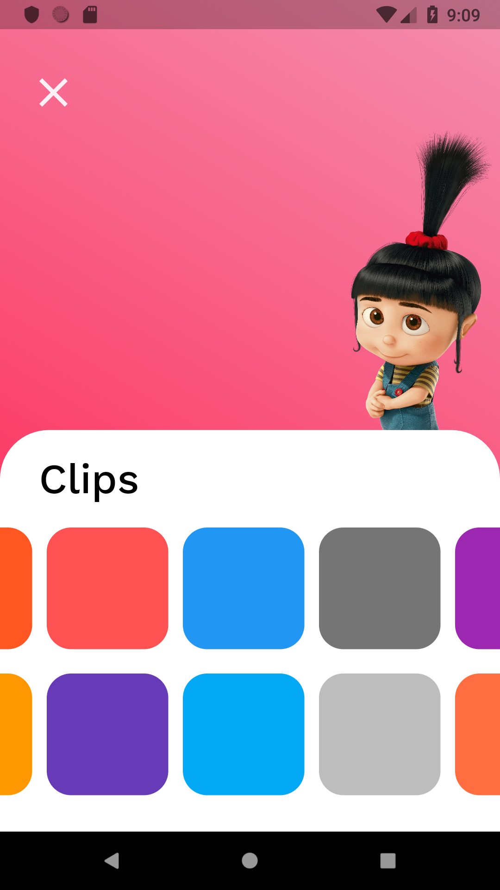

# Despicale Me Characters ♥ Flutter ♥ app 

- This is app contain pageController (ViewPager in Android) 📟
- And Routers between pages. 🔃
- Hero Animation. 💌
- AnimatedPosition 
- Event for change background color 

** The 🌳 app ** 
- Main file (entry page) 🚉
    - CharactersListScreen class.
        - CharacterWidget class.
            - CharacterDetails class.
- Utilises (this class connecting all classes) 👆
- CharactersModel (model) ⭐⭐
